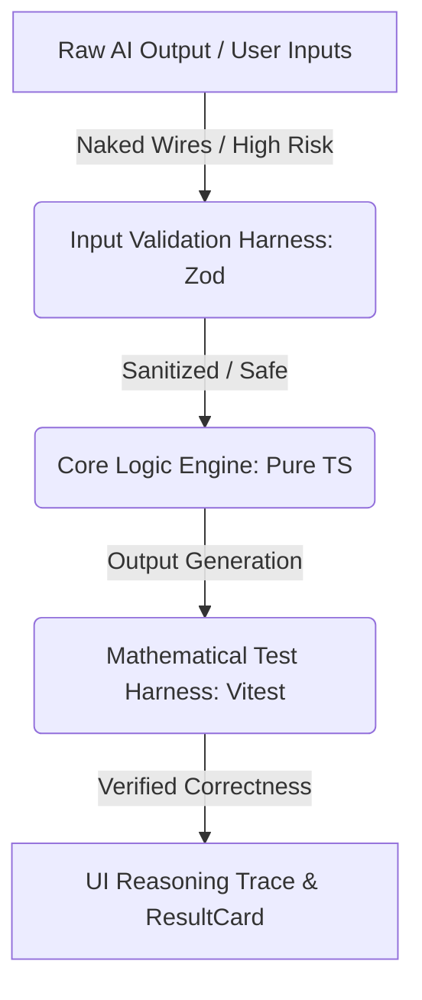

# DummVinci — Harness Engineering & Architecture Standards

> **Mindset Shift**: *“An engine without a harness is just a dangerous explosion; a model without a harness is just a hallucination.”*  
> This document defines the engineering discipline, standards, and harness-driven mindset within the DummVinci Calculator ecosystem.

---

## 1. The Harness Engineering Philosophy

In electrical and control panel engineering, a **Wiring Harness** bundles, insulates, routes, and secures individual wires. Without it, cables would short-circuit, catch fire, or break under vibration.

In software and AI engineering, **Harness Engineering** is the practice of designing the rigid infrastructure, runtime constraints, and verification loops around an application's logic or AI models to ensure production-grade reliability. We treat prompts and AI outputs as "naked wires"—highly conductive but extremely volatile. We never deploy naked wires.

---

## 2. The Core Harness Taxonomy

DummVinci Calculator implements five levels of engineering harnesses:

### Level 1: Input & Data Validation Harness (Zod Schemas)

* **Mindset**: Every input entering our pure calculation engines (`lib/calc/*.ts`) must pass through a strict, typed boundary.
* **Rule**: Never rely on raw UI parsing. Every form submission or API input must be parsed using Zod schemas to ensure constraints (e.g., minimum voltage, positive current, matching phase counts) are satisfied before calculating.
* **Implementation**: All tool schema inputs for Agent integrations are declared with detailed description fields and type schemas.

### Level 2: Mathematical Test Harness (Vitest Unit Tests)

* **Mindset**: Calculator engines are safety-critical. A 5% deviation in cable ampacity or breaker trip settings could cause real-world fires or trip failures.
* **Rule**: All math engines in `lib/calc/` must be wrapped in an automated test harness running **Vitest**. No modifications to engineering formulas may be merged without passing the test harness.
* **Optimization**: Test harness executes in `< 50ms` using memory-only mocks of catalog databases.

### Level 3: AI Agent Runtime Harness (Lints, Compiles, and Graph reviews)

* **Mindset**: Code generated by AI agents (Claude, Gemini, ChatGPT) must be validated before it is trusted.
* **Rule**: The AI agent is restricted to run within a verification harness:
  * **Static Analysis**: ESLint flat config checking rules (`npm run lint`).
  * **Type Safety**: TypeScript compiler check without emitting files (`npx tsc --noEmit`).
  * **Graph Impact**: Using `code-review-graph` MCP tools to analyze the blast radius of any refactoring before editing code.

### Level 4: UI Sizing Reasoning Harness (Traceability)

* **Mindset**: Sizing recommendations are never "black boxes". The user must be able to audit how a result was derived.
* **Rule**: The `ResultCard` and calculator pages must output a **Reasoning Trace** displaying:
  * The base standards used (e.g., *IEC 60364-5-52 Table B.52.4*).
  * Applied derating factors (ambient temperature, cable installation method, grouping factors).
  * Calculation steps (resistance and reactance equations for voltage drop).

### Level 5: Wiring Harness Sizing Standard

* **Mindset**: For calculators that handle actual wiring, we implement physical harness sizing logic.
* **Rule**: Sizing algorithms for panels, cable trays, or wireways must calculate bundle diameters and thermal heat-loss factors per DIN or IEC standards to ensure cables do not exceed temperature limits when packed tightly.

---

## 3. Operational Standards

### Pure TS Logic Separation

All core calculation logic lives inside `lib/calc/`. These files:

* Must have **zero side-effects**.
* Must not import React, Next.js page components, or window/browser objects.
* Must be fully importable and runnable within the Node.js/Vitest test runner.

### Versioning and Reference Data

* **No Magic Numbers**: Reference values (e.g., ambient derating coefficients) must include inline comments citing the exact table of the IEC/DIN/ABB standard.
* **Fallback Flags**: If catalog datasheets do not list a specific frame or model size, return a standard warning string instead of returning undefined or throwing runtime errors.

---

> *"By DummVinci · Harness Sized & AI Guarded"*
